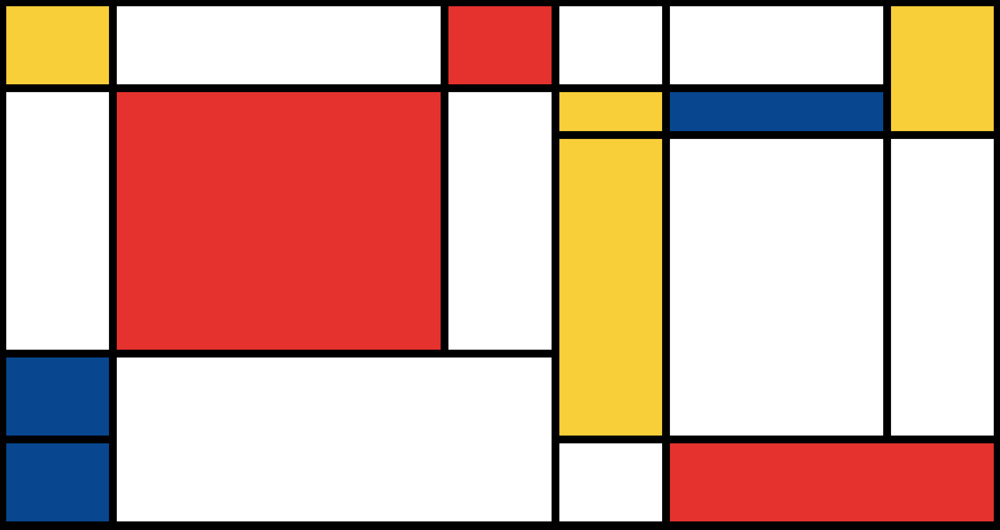

# Mondrian Project

This project showcases a Mondrian-inspired design using HTML and CSS.

## Table of Contents

- [Description](#description)
- [Installation](#installation)
- [Usage](#usage)
- [Credits](#credits)

## Description

The Mondrian Project is a web page that displays a design inspired by the artwork of Piet Mondrian. It uses CSS Grid to create the layout and applies different colors to the grid cells to mimic Mondrian's distinctive style.

## Installation

1. Clone the repository:
    git clone https://github.com/JD-R0driguez/mondrian-project.git

2. Navigate to the project directory:

    cd mondrian-project

3. Open the `index.html` file in your web browser.

## Usage

Feel free to explore the project and interact with the Mondrian-inspired design. You can also customize the colors or grid layout in the CSS file (`style.css`) to create your own variations. To view the live code, click [here](https://jd-r0driguez.github.io/mondrian-paint-project/).

## Credits

This project is created by [JD-R0driguez] as part of the CSS web development fundamentals

